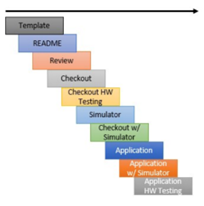

# Component Development:

## Template Generation  
The development of a new component starts with using the template generator provided by NOS3. This template establishes a standard format and structure for the component, ensuring consistency and combability with the rest of the framework.  

## Component Documentation Review 
Review and update the documentation for the component to provide comprehensive information about the software interface between the hardware component and flight software. The component readme should include details on the document and versions utilized during development and a comprehensive test plan. It is recommended to have another developer or team member to review the documentation and ensure its completeness and accuracy.  

## Standalone Checkout Application Development 
Develop a standalone checkout application that serves as a test environment for the component. This application can be built to run in the NOS3 simulation or on a development board.  

## Hardware and Flight Software Integration 
In cases where hardware availability is delayed, the development of the flight software application can procced using the same functions and hardware library calls used in the standalone checkout application. This approach ensures that the flight software application primarily serves as an integration test with the rest of the software components, including the ground software and associated integration tests documented in the test plan. Note that the simulation is not a replacement for traditional hardware testing, but an additional tool to be used to reduce schedule and risk.  

## Component Updates and Refinements 
Once hardware testing becomes possible, additional time should be allocated to update the component based on insights and findings from the testing from the hardware testing phase. This includes making necessary adjustments within the NOS3 framework to ensure proper functionality and performance.  

## Generic Components
These components provide a standardized starting point for building simulations and training materials. By including generic components, NOS3 can showcase standard commands, telemetry, and interfaces to potential users who are not familiar with the underlying software modules. 

The generic components in NOS3 ensures that the framework remains adaptable, flexible, and relevant to a wide range of small satellite missions. It empowers developers and mission teams to leverage existing components as building blocks and focus their efforts on specific mission requirements and optimizations, rather than starting from scratch.   

