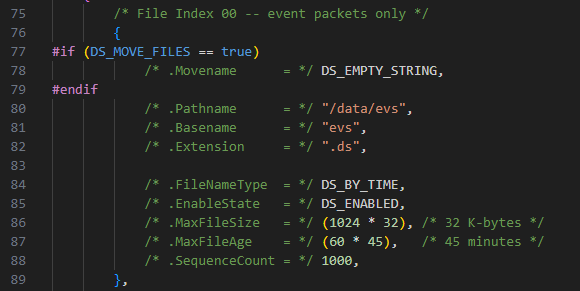
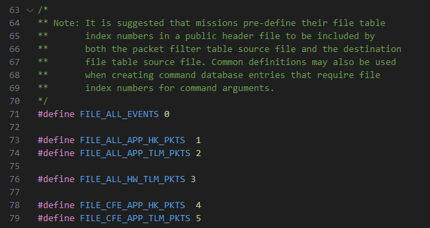

# cFS Tables
Several cFS Apps rely on tables ton configure them. The main ones that are preconfigured by NOS3 are the ones for cf, ds, fm, hk, sc, sch, and to. The main ones the user would likely want to configure for their mission and the ds, sc, and sch tables.

## DS Tables
DS, or Data Storage, utilizes three main tables - the File Table, the Filter Table, and the Indices table. The Indices table can likely be left as default in most cases, leaving the File and Filter tables as the main ones you would likely want to reconfigure.

### DS File Table
The DS File Table is defined at {nos3_base}/cfg/nos3_defs/tables/ds_file_table.c. It handles the definition of files for the data storage app, which allow the logging of user-defined sets of packets from the cFS Bus to a file which can be saved off by the user for analysis. By default, 4 files are fully created and two more are semi-defined, and it allows for a maximum of 16 files (indexed 0-15).

The user should start by picking an unused index, and creating a #define in the list at the top aliasing the index number of their file with its name.

The image above is the default event packet log file for NOS3, and shows the following file attributes which the user can define. 
* Movename allows you to define a path where you want the file to be moved and stored on simulator shutdown. 
* Pathname is the relative path within the spacecraft's base storage at which you want the file to be created (the spacecraft's files are found at '{nos3_base}/fsw/build/exe/cpu1').
* Basename sets the base filename of the file
* Extension sets the file extension for the file (".ds" by default)
* FileNameType defines whether you are rolling the file (and thus extending the filename) by time or count.
* EnableState defines if the file start out as enabled or disabled. If enabled, it will collect data from simulation start. If disabled, the user must manually activate it using a command before it starts collecting data
* MaxFileSize defines the max size of a file before it is rolled (in bytes by default, so multiples of 1024 increase to KB, MB, GB, etc)
* MaxFileAge defines the max age of a file before it is rolled (in seconds)
* SequenceCount is only used if rolling by count. Otherwise can be left as DS_UNUSED. If used, will define the starting count for the file

Once the user defines all attributes as desired, the user should go to {nos3_base}/scripts/docker_launch.sh, and after line 32 should add a `mkdir` command like the ones above it with any new data directory in which they plan to spawn their file. If they are spawning it in an already extant directory, this can be skipped. Then, once this is done the file should be created on startup, though it will not accrue data unless the Filter Table has already been configured to send packets to it.

### DS Filter Table
The DS Filter Table is used to define what packets DS should send to what files to be stored. Initially, only the small subset of packets stored in the default files are defined, but the user can both add more packets, and define what tables new and existing packets should be sent to.

First, you should add a #define matching the one you added to the file table to alias the index of your table to its name, so that you can use your name later on, as shown here:

Then, the user will want to edit the entry for a packet. There are 256 slots for packets (indexed 0-255), of which 15 are defined by default. Below is an example of what one of these entries looks like:

The entries are structured as follows:

* MessageID is the MID of the packet you wish to add. These can be found within the [app]_msgids.h files found in each app's source code. These should already be linked into the build structure for DS, so further files should not need to be added. To add a new packet, simply find the MID you wish to add, and replace `CFE_SB_MSGID_RESERVED` in an unused entry with your desired MID wrapped within `CFE_SB_MSGID_WRAP_VALUE()`, as seen in the example image.
* The Filter contains the entries for what files you wish to forward that packet to for storage. It contains an entry for each file, structured as follows: 
  * The index of your file, as defined in the `#define` step above.
  * The filter type (generally by count, so that you are collecting each packet generated)
  * N, which is the numerator of the ratio of packets to store by sequence number
  * X, which is the denominator of the ratio of packets to store by sequence number
  * O, which is the offset, defining the sequence number of the first packet to store
  So, for example, N = 1, X = 1, O = 0 would store every packet starting at the 0th index, while N = 1, X = 2, O = 2 would store every other packet starting at the 6th packet

Once you have defined all your new packets and storage parameters, then as long as your file table and directories are properly created, your file should start populating with all the right packets upon startup. 

## SC RTS Tables
RTS Tables are utilized by the SC - or Stored Command - app to allow users to set up sequences of commands that can be triggered via a single set of commands from the ground. 

TODO - Details on RTS Tables