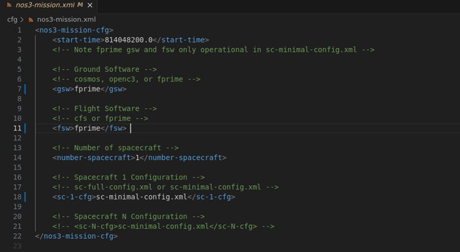
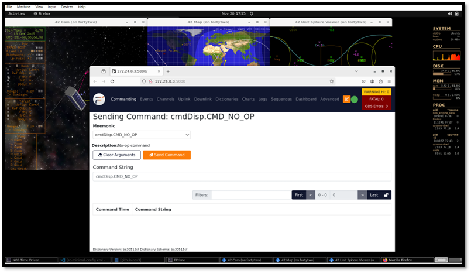
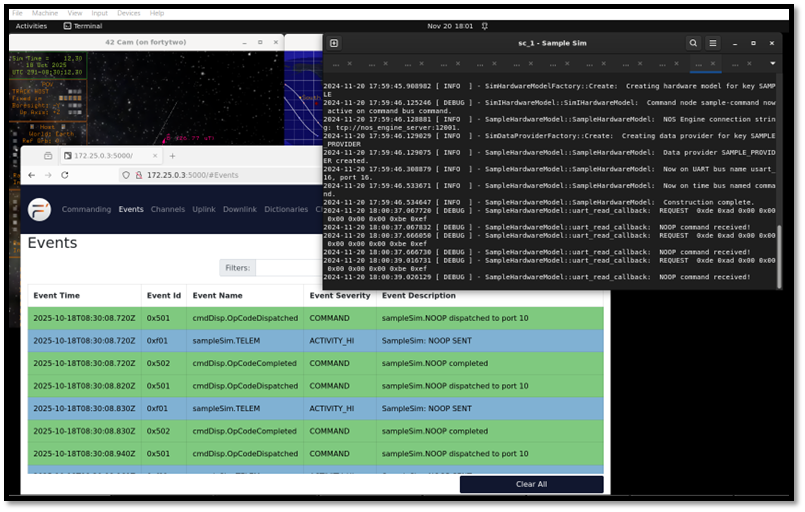

# F-Prime Documentation

## What is F-Prime:

(Courtesy of <https://nasa.github.io/fprime/>)

F´ (or F Prime) is a software framework for the rapid development and
deployment of embedded systems and spaceflight applications. Originally
developed at NASA’s Jet Propulsion Laboratory, F´ is open-source
software that has been successfully deployed for several space
applications. It has been used for but is not limited to, CubeSats,
SmallSats, instruments, and deployables.

F´ has the following features:

-   Component architecture with well-defined interfaces

-   C++ framework providing core capabilities like queues, threads, and
    operating-system abstraction

-   Tools for designing systems and automatically generating code from
    systems design

-   A standard library of flight-worthy components

-   Testing tools for unit and system-level testing

## Configuring Nos3 to Use F-Prime:

When Building NOS3 with F-Prime, it may be necessary to clone NOS3 in a
Linux environment, rather than attempt to build with shared folders. You
can use the NOS3 VM and clone NOS3 in **/home/jstar/,** rather than use
the github-nos3 shared folder in the NOS3 VMs Desktop. Building F-Prime
with shared folders can sometimes result in build errors due to the
shared folder, however building locally inside the Linux environment
will ensure NOS3 builds successfully.

When Configuring NOS3 to use F-Prime. Be sure to edit the
nos3-mission.xml file to select F-Prime as your GSW and FSW as seen
above. After changing you mission configuration, save the file and run
**make clean** from your nos3/ directory. Run **make** to rebuild NOS3
for the F-Prime FSW and GSW configuration. Once NOS3 is built, run
**make launch** and wait for the F-Prime gds window to launch. Below is
a picture of the NOS3 Configuration needed to build F-Prime.



Note, if a NOS3 user wishes to add fidelity to F-Prime. The user must
**make clean** to remove autogenerated files so that F-Prime can be
built again. Once NOS3 is cleaned, simply run make to rebuild F-Prime
FSW with new additions.

## Sending a Sample NOOP Command:

After the F-Prime GDS window launches, F-Prime FSW should be running and
the Sample component can be commanded. To send a SampleSim noop command,
select the SampleSim.NOOP command from the drop down menu in the F-Prime
GDS. You will then seen the noop command Completed event message under
the events tab in the F-Prime GDS window. You will also see the command
process in the SampleSim terminal window in NOS3. The below figures
represent an example of what commanding looks like in the F-Prime GDS.





## Creating an F-Prime Component in NOS3:

To create a NOS3 component in NOS3, first enter the nos3 debug by
running **make debug** in the nos3/ directory.

After running make debug, navigate to the
**fsw/F-Prime/F-Prime-nos3/Components** directory.

Here you can create a new F-Prime component by running the following
command: **F-Prime-util new –component**

Note, you do not need to run the F-Prime virtual python environment in
order to use the F-Prime framework tools to create an F-Prime project.
NOS3 has included the F-Prime tools inside its docker container which is
why the make debug is used to generate the new component in F-Prime.

For more information on how to create F-Prime projects, components,
deployments, etc. You can see the F-Prime documentation found here:
[https://nasa.github.io/F-Prime/](https://nasa.github.io/fprime/)

The Helloworld tutorial helps a user understand how to use F-Prime and
how to get started with developing using the F-Prime FSW framework. This
tutorial explains how to setup an F-Prime project, however a user can
use the existing F-Prime project found in NOS3. That is F-Prime-nos3/
which is found under **fsw/F-Prime/**. The Helloworld tutorial also
describes how to create basic F-Prime connections to launch a new
component in the F-Prime-gds.

The Nos3 Developers were able to utilize NOS3 Component fidelity to
communicate to simulations in NOS3 without having to start from scratch
in F-Prime. For example, with the sample component in Nos3, the
developers were ablet to include the necessary NOS3 libraries and files
in the F-Prime cmake files in the Component/ and Deployment/
directories. This allows F-Prime to pull in the necessary function calls
from NOS3 to F-Prime fsw. For an example refer to the Sample component
in F-Prime, you will see how commanding is setup in the F-Prime
component by utilizing the existing NOS3 fideltiy.

It is important to understand that each component has its own cmake
file, so when creating new components based of NOS3 Components, you need
to be sure you are including the necessary files from the NOS3 Component
directory. Also, each file you share with F-Prime in the F-Prime
Component, you need to share with the F-Prime Deployment. There are two
cmake files in the Deployment directory

## F-Prime NOS3 Time Component (Nos3Time):

Here we explain how we synchronize time from NOS3 to with F-Prime by
creating our own passive F-Prime component. This component can be found
under fsw/F-Prime/F-Prime-nos3/Components. There you will find the cpp
and fpp files that make up the Nos3Time component in F-Prime. These
files are explained in more detail below.

 

Starting with Nos3Time.cpp, we establish a couple functions in F-Prime
to successfully retrieve NOS3 Time and sync that data for F-Prime FSW.

NOS Engine supplies time on a created bus interface.

The interface is created with the following nos engine connection string:
```
“tcp://nos\_engine\_server:12000”
```

 

This describes the type of connection, where the connection is being
made, and on which port. This string is used when creating our Fprime Bus in the Nos3Time.cpp.

 

Following this, users need to set up a Buse Name, a TICKS\_PER\_SECOND
variable. These will allow for the connection of a component to this bus
via a call-back function which will provide NOS Engine time on each tick
being populated in the above created bus. This is accomplished using a
NOS Engine create bus command, and the add call back command:

 
```
NE\_create\_bus(hub, ENGINE\_BUS\_NAME, ENGINE\_SERVER\_URI);

NE\_bus\_add\_time\_tick\_callback(F-Prime\_Bus,
F-Prime\_NosTickCallback);
```

 

A callback function should look similar to the following:

 
```
void F-Prime\_NosTickCallback(NE\_SimTime time)

{
    pthread\_mutex\_lock(&F-Prime\_sim\_time\_mutex);
    F-Prime\_sim\_time = time;
    pthread\_mutex\_unlock(&F-Prime\_sim\_time\_mutex);
}
```

The local function, relative to the F-Prime component,
F-Prime\_NosTickCallback is used to retrieve the ticks (each tic is 100
seconds). Then simple math is performed to place the seconds (upper U32
) and microseconds (lower U32) into the F-Prime time.set call described
later in this documentation.

This will pull time from the bus, and store it in a time variable
(F-Prime\_sim\_time). This variable holds the number of ticks that have
been supplied on the created bus. This variable is a tick counter
variable. To convert to actual time, users will need to manipulate the
ticks into seconds and micro seconds for F-Prime. This is done utilizing
the TICKS\_PER\_SECOND variable in order to create the conversions. An
offset can be added to specify any specific start 0 date.

All of this functionality can be placed in its own component, and
through the deployment topology, pointed to utilize the new time
component rather than default POSIX time. This is where we adjusted our
deployment to use our Nos3Time component instead of the default
PosixTime component in F-Prime. Below are the key lines we changed in
our deployment topology.

```
Instances (instances.fpp):
```

```
instance nos3Time: Components.Nos3Time base id 0x4500
```

Topology (topology.fpp):

```
time connections instance nos3Time
```

After the component has been integrated into the deployment, and
references to posix time removed, the component and GUI will now use the
new NOS3Time after manipulating the timeGetPort\_handler (in
Nos3Time.cpp undercomponents) as such:

```
time.set(TB\_WORKSTATION\_TIME,0, Nos3Time\_upper,
Nos3Time\_lower);
```

Note, we are overwriting the F-Prime time base workstation enum, but one
could easily create another enum to use if they choose to do so. This
would be done FpConfig.h in the F-Prime FSW. Also, we could also use the
TB\_Dont\_Care enum to overwrite time in F-Prime, but this adds a slight
delay at the beginning of time synchronization between nos engine and
F-Prime.

 

## F-Prime Documentation links:

-   F-Prime github Docs:
    [https://nasa.github.io/F-Prime/](https://nasa.github.io/fprime/)

-   F-Prime cpp Docs:
    [https://nasa.github.io/F-Prime/UsersGuide/api/c++/html/index.html](https://nasa.github.io/fprime/UsersGuide/api/c++/html/index.html)

-   F-Prime fpp Docs:
    [https://nasa.github.io/F-Prime/UsersGuide/user/fpp-user-guide.html](https://nasa.github.io/fprime/UsersGuide/user/fpp-user-guide.html)
