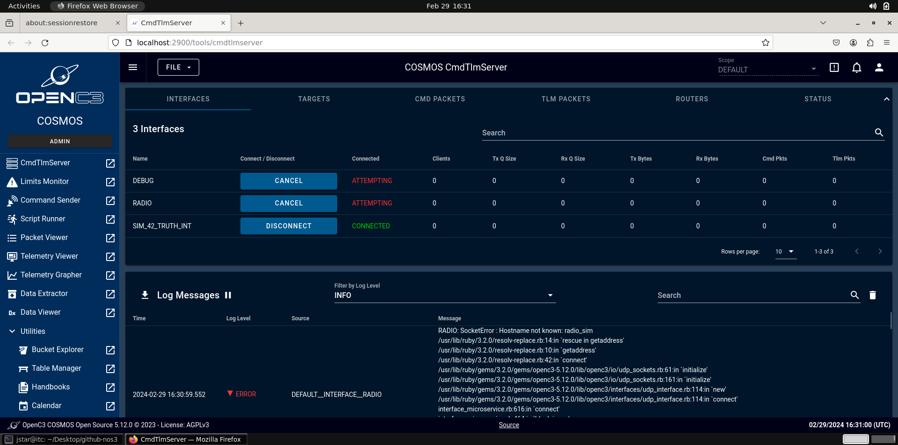
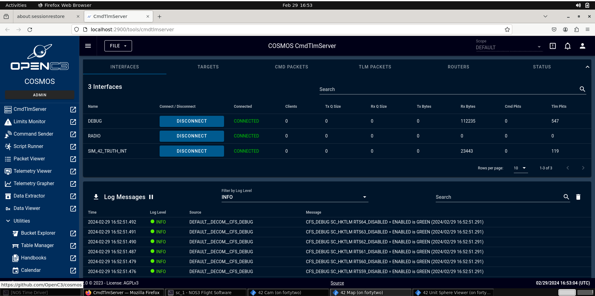
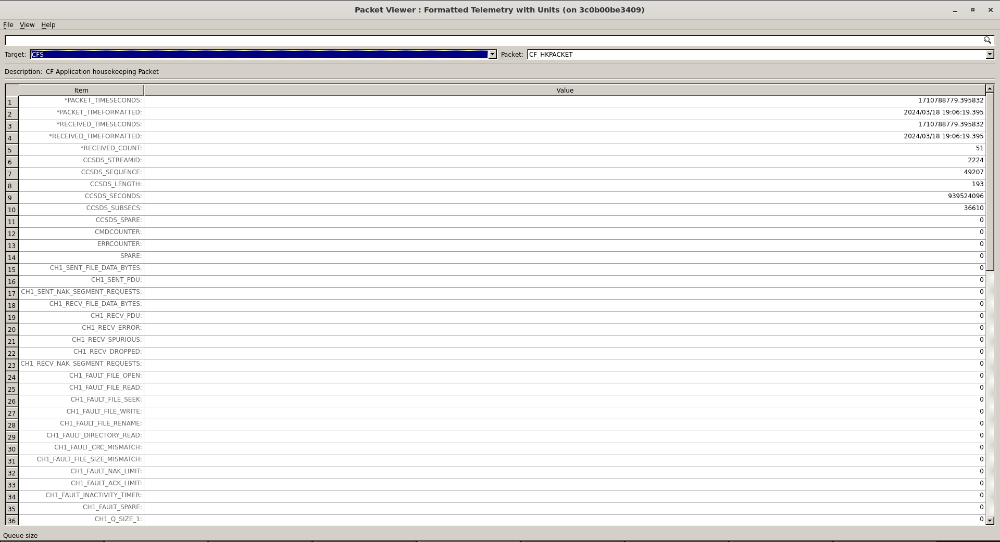
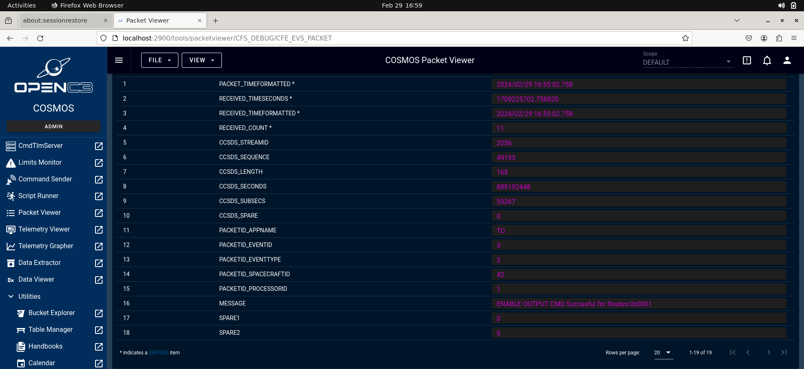

# Getting Started

Installing, Building, and Running NOS3

## Installing NOS3

On the host computer:

1. Install [[Oracle VirtualBox v6.1+](https://www.virtualbox.org/)](https://www.virtualbox.org)
2. Install [[Vagrant v2.2+](https://www.vagrantup.com/)](https://www.vagrantup.com)
3. Install [[Git 1.8+](https://git-scm.com/downloads)](https://git-scm.com/downloads)

### Clone

1. Open a terminal and navigate to the desired location for the repository
  
2. Clone the repository in the terminal using `git clone https://github.com/nasa/nos3.git`
  
3. `cd nos3`
  
4. `git checkout dev`
  
5. Clone the submodules with `git submodule update --init --recursive`
  
### Provision
  
6. Run `vagrant up` and wait to return to a prompt
  
  - This can take anywhere from a few minutes to hours depending on internet speeds and host PC specs
  - **Important:** Internet access is **required** when installing
  - The VM may reboot multiple times in order to finish installing packages for you automatically, so wait for that prompt!
  - **Sometimes ansible does not seem to install and there is an error like "Could not get lock /var/lib/apt/lists/lock". If this happens, run `vagrant provision` to install ansible and provision.**
7. Vagrant will automatically load the virtual machine to Virtual Box, and it will be ready for use, though more RAM and CPU cores should probably be added if possible on Virtual Box before use.
  
8. Login to the **_jstar_** user using the password **_jstar123!_** and get to work! (If needed, the **_vagrant_** user has password **_vagrant_**)
  

## Building NOS3

Log in to the NOS3 VM, username / password : `jstar` / `jstar123!`

1. Access the nos3 repository on the host machine. (This may already be done if you do `vagrant up`. Vagrant mounts the nos3 repository in the VM at `/home/nos3/Desktop/github-nos3`.) From the guest VM:
  1. Add Virtual Box Guest Additions:
    1. Go to Virtual Box menu -> Devices -> Insert Guest Additions CD image...
    2. Click `Run` in the resulting dialog box
  2. Add a shared folder with the nos3 repository code:
    1. Go to Virtual Box menu -> Devices -> Shared Folders -> Shared Folders Settings...
    2. Add a new Shared Folder (folder with + sign) and select the location of the nos3 repository on the host
    3. Check `Auto-mount` and `Make Permanent`
    4. Reboot the VM
2. Build the NOS3 software
  1. In a terminal, navigate to the nos3 shared folder after the VM reboot above
  2. Run `make clean`
  3. Run `make prep`
  4. Once COSMOS is launched and you set the password and the terminal is done outputting, run `make`

## Running NOS3

In the NOS3 VM:

1. In a terminal, navigate to the nos3 shared folder (created by Vagrant at `/home/nos3/Desktop/github-nos3` or created by you using the instructions above)
2. Run `make launch` in the nos3 directory from the terminal
  
3. To exit the simulation, run `make stop` in the nos3 directory from the terminal
4. To rebuild NOS3 from the repository baseline, first run `make clean` and then run `make prep` and then run `make`

## Running COSMOS

Once `make prep` is run, COSMOS 5 _NOS3 Web Interface_ will start. Once `make launch` is run, cFS and 42 will launch and link in to COSMOS. If using COSMOS 4, the COSMOS 4 GUI should launch during the make launch Script.

COSMOS 4 Launcher

COSMOS 4 Main Windows

COSMOS 5 Web UI

COSMOS may command cFS to send telemetry back to COSMOS by:

1. The _NOS3 Web Interface_ should show the COSMOS _Command and Telemetry Server_ by default. If not, switch to it and assure the following are done and true:
  1. Run `make` if needed, then `make launch`. At this point Flight Software will boot up.
  2. The terminals with cFS, along with the dynamics sim windows for 42, should show up.
  3. Once they have, for the _MISSION_INT_ interface, the _Connected?_ attribute should read `true`
   
2. From the _NOS3 Web Interface_, open the COSMOS _Command Sender_ and enter:
  1. In the _Command Sender_ Window, select _Target_ to be `CFS`
  2. Select _Command_ to be `TO_ENABLE_OUTPUT_CC`
  3. Click `Send`

  _Note: In current versions of NOS3, this debug output should already be set up by default. However, to enable Radio Telemetry, follow the same steps 
except go to `CFS_RADIO`, and run the command with the `DEST_IP` of `'radio_sim'` and the `DEST_PORT` of `5011`, of whatever values fit your setup._ 
   

COSMOS 4 Radio Enable

COSMOS 5 Radio Enable

3. Notice under the _COSMOS Command and Telemetry Server_ Window that the following data fields update:
  1. `Bytes Tx` and `Cmd Pkts` should change from 0 to a positive number
  2. `Bytes Rx` and `Tlm Pkts` should start counting up as telemetry is received

COSMOS 4 Command and Telemetry Server with Radio Enabled

COSMOS 5 Command and Telemetry Server with Radio Enabled

4. From the _NOS3 Web Interface_ or _COSMOS GUI_, open the COSMOS _Packet Viewer_:
  1. In the _Packet Viewer_ Window, select _Target_ to be `CFS`
  2. Select _Packet_ to be `CFE_EVS_PACKET`
  3. Scroll to see the _MESSAGE_ field live updates (line 16)
  4. Telemetry packets may be viewed for other apps, once they are commanded to send telemetry
  5. Application telemetry fields which are stale are displayed in fuscia
  _Note: The same should apply for Radio, except go to `CFS_RADIO` instead of `CFS`_

COSMOS 4 EVS Packet

COSMOS 5 EVS Packet

### Reset

1. To exit the simulation, run make stop in the nos3 directory from the terminal
2. To build NOS3 from the repository baseline, first run `make clean` and then run make launch
3. If you plan to switch ground software between COSMOS 4 and COSMOS 5, be sure to run `make stop-gsw` *before* running `make clean` and `make prep`