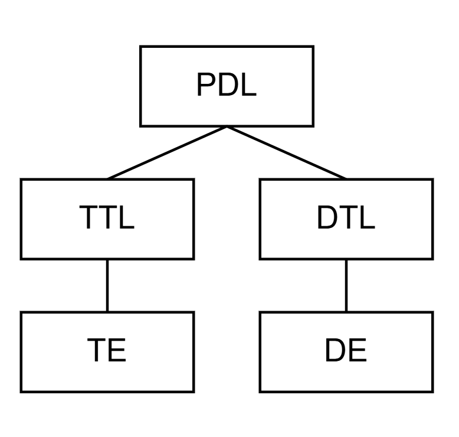
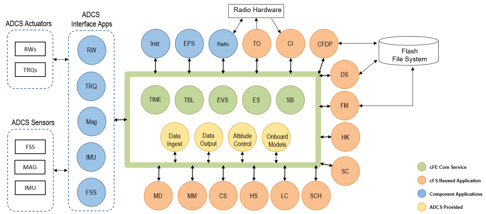
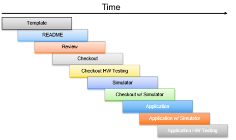

# STF - Software Development Plan
Note: Simulation To Flight (STF) is a design reference mission attempting to follow Class A practices

## Required Materials

| Website/Support System | Reference #/URL|
| ---------------------- | ---------------------- |
| NASA Software Engineering and Assurance Handbook | NASA-HDBK-2203: https://swehb.nasa.gov/ |
| The NASA Software Engineering Requirements | NPR 7150.2D: https://nodis3.gsfc.nasa.gov/displayDir.cfm?t=NPR&c=7150&s=2D |
| The NASA Software Assurance and Software Safety Standard requirements | NASA-STD-8739.8B: https://standards.nasa.gov/sites/default/files/standards/NASA/B/0/NASA-STD-87398-RevisionB.pdf |

## Software Management Approach

The management approach described in the following sections is consistent with the approved processes. The PDL has primary responsibility for managing this effort, with other members of the PDT providing support as needed.

### Product Development Team:

A team consisting of the PDL, other leads, developers, testers, and support personnel, who work together are referred to as the Product Development Team (PDT). The PDT will be assembled to develop, integrate, test, and deliver the system and all associated products.

This section describes the organization, roles and responsibilities, and plan for training the PDT.

### Organization:

The Project Development Teams (PDT) is led by the PDL and is comprised of one or more Development Teams consisting of Development Engineers (DEs) lead by a Development Team Lead (DTL); a Test Team consisting of Test Engineers (TEs) led by a Test Team Lead (TTL).

### Roles, Responsibilities, Authority, and Accountability:

| Role | Role Description |
| ---------------------- | ---------------------- |
| PDL | Product Development Lead - Person in charge of project management activities and leading the team. This role is primarily a project management role. Has primary responsibility for the following process areas within the project: project planning; project monitoring and control; measurement and analysis; risk management, and decision analysis resolution. Has primary responsibility for leading/monitoring technical activities such as requirements development, management, design, implementation, verification, and validation.|
| DTL | Development Team Lead - Leads team responsible for developing a given subsystem(s) or system(s). Performs requirements analysis and high-level design. Also known as Subsystem Lead or Senior Developer. Has primary responsibility for the Design and Implementation process area. Supports the PDL with requirements development and management. Supports verification and validation by conducting reviews and supporting team teams. May support the PDL in the following process areas for the assigned subsystem(s)/system(s) being developed: planning; monitoring and control; measurement and analysis; and risk management. |
| TTL | Test Team Lead - Responsible for the integration and test of the entire flight or ground system. Leads an independent test team. Has primary responsibility for the Verification and Validation process area. May support the PDL in the following process areas for the test area: planning; monitoring and control; measurement and analysis; and risk management. |
| DE | Development Engineer - Responsible for detailed design, implementation, integration, and build-integration testing. Supports requirements engineering.|
| TE | Test Engineer - Responsible for executing the build verification tests, system validation tests, and acceptance tests, including evaluation of the results. Supports spacecraft integration & test activities. Also known as Software Tester.|

## Software Technical Approach

### Project Life Cycle:
The PDT will use an Evolutionary Development model on this project. The Table below describes each life cycle phase in terms of the major activities conducted during the phase, the major products produced during the phase, the major stakeholders involved, and the criteria for exiting (i.e., completing) the phase. The documentation for this effort is reflected in the list of documents provided in the “Products” portion of the table in each phase.

| Phase | Description | Environment | Products | Major Stakeholders | Exit Criteria |
| ---------------------- | ---------------------- | ---------------------- | ---------------------- | ---------------------- | ---------------------- |
| Concept Definition | The PDT formulates a conceptual architecture by working with the Project to understand the system concept and high-level requirements and by looking for similarities to previous systems. To the extent possible, the PDT uses their experience to guide the Project in making trades affecting (or affected by) the system. | Requirements Design Environment | · Operations concept  · Concept review materials  · SDP signed and approved by signatories  | · PDT  · Project Management  · Branch Management  -Users  | · Concept review materials are reviewed and approved  · Action Items are assigned and scheduled for completion  |
| Requirements and Architecture Definition | The PDT works closely with the Project to understand and document the software requirements for the system.   Software requirements, including interface and performance requirements are derived from Project requirements and documented. The requirements are analyzed and reviewed for completeness, consistency, feasibility, and testability. Requirements that potentially drive software design decisions, (e.g., special timing requirements, checkpoint restart) are identified. A Requirements Traceability Matrix (RTM) is produced, showing how the high-level requirements flow down to software requirements. | Requirements Design Environment | · Requirements Document(s)  · Requirements Traceability Matrix (RTM)  · Software Requirements Review (SRR) Materials  | · PDT  · Project Management  · Branch Management  -Users  | · SRR materials are reviewed and approved  · SRR Request For Action (RFAs) are assigned and scheduled for completion  · Requirements are baselined and placed under configuration management  |
| Implementation | New units are coded from requirements and design, and modifications to re-used units are made as required. Source code is peer-reviewed and inspected according to standards. The PDT shall identify, record, and implement secure coding practices and verify that the software code meets the project’s coding standard by using the results from static analysis tool(s).  Unit test plans and procedures with expected results are written. New and modified units are unit tested according to standards. Unit test reports are written and documented. The PDT shall assure that the unit test results are repeatable.  System components are integrated into a build. Build integration test procedures are written, executed, and test results are reviewed. Problem reports are written and corrected as appropriate. | Development Environment | · Source Code  · Unit test drivers, unit test plans, unit test data, and unit test reports  · Build integration test procedures and test results  · Test Plan (Final)  · User’s Guide (Draft) · Integrated and tested software executables  · Reuse candidates  | · PDT  · Project Management  · Branch Management  | (For each build)  · Unit test of each unit for a specified build are successfully executed in accordance with the unit test plan. · Build integration tests are successfully executed in accordance with approved build integration test procedures. · Build integration test reports are reviewed and approved.  |
| Release Integration and Test | System test scenarios and detailed test procedures are written, peer-reviewed, and corrected.  Requisite test software and /or test equipment is configured, tested, and verified for adequacy and correctness.  System tests are conducted according to the Test Plan and associated procedures. System test results are recorded, and a System Test Report is written and reviewed. Problem reports are written and corrected as appropriate.  Perform preparation for any transition to long term maintenance, particularly when maintenance will be performed by a separate team from the development team (sustaining engineering).  The system and its associated documentation are packaged for delivery.  This section of the table may be tailored when system testing is not the responsibility of the development team - simply indicate here the organization that is planning and conducting system testing.   | Test Environment | · System test procedures, test results, and test report  · Problem reports  · Acceptance Test Readiness Review (ATRR) materials · Delivery Package  | · PDT  · Project Management  · Branch Management  · Users  | · Final system tests are successfully executed  · System Test Report is completed  · ATRR materials are reviewed and approved  · Problem reports are submitted  · All critical problem reports are implemented, delivered, verified and validated.  |
| Operations, Maintenance, and Retirement | The PDT provides technical support such as consulting and analyzing test results as required during post-delivery test support. If any changes are required because of these tests, problem reports may be generated and approved. Following solution selection and implementation of corrections for these problem reports, Build Test and System Test will be repeated, with test upgrades as necessary to re-validate the updated system. | Test Environment | · Source Code · Updated and tested software executables (as needed)  · Documentation updates (as needed) · User’s Guide (Final)  | · PDT  · Project Management  · Branch Management  · Users  | N/A |

### Life Cycle Reviews:
The PDL regularly holds reviews of software activities, status, performance metrics and assessment/analysis results with the project stakeholders and track issues to resolution [SWE-018] [SWE-143].  

The PDT will conduct end-of-phase life cycle reviews as a mechanism for validating system work products. A Review Panel consisting of Project representatives, subject matter experts independent of the PDT, users, managers, and other interested parties will be selected as appropriate for the topics to be discussed in each review. 

For each review, Requests For Action (RFAs) are recorded and assigned by the PDL to members of the PDT for analysis and response. 
The PDT will conduct or participate in the following formal milestone reviews:
- Mission CDR
- Mission Pre-Environmental Review
- Mission Pre-Ship Review

### Software Design:
The project will develop, record, and maintain a software design that describes the lower-level units so that they can be coded, compiled, and tested [SWE-057] [SWE-058] [SWE-143]. 

STF will utilize the core Flight System (cFS) and several of the standard applications (as seen below) it provides such as: Data Storage (DS), File Manager (FM), Limit Checker (LC), Stored Commands (SC), and Scheduler (SCH). A standardized workflow will be followed to develop STF specific applications:

### Software Workflow:

The above workflow enables rapid development and prototyping due to the NASA Operational Simulator for Small Satellites (NOS3) environment. This essentially is a virtual spacecraft which enables development and has been baselined as a kickoff point for the STF effort. 

### Software Implementation:
The project will implement the requirements and design into software code using the environments and tool described Later in this document [SWE-060]. The development team will use the following software coding standard(s), for ensuring code quality, maintainability, safety, coding styles, and including secure coding practices [SWE-061] [SWE-207]:
- GSFC Code 582, C Coding Standards (https://ntrs.nasa.gov/citations/20080039927)

This coding standard(s) will also be used as a review criterion in software peer reviews. The coding standard rules may also be checked by running static code analyzers.

### Static Code Analysis:
This section describes the project’s use of static code analysis tools for adherence to coding standards, cyclomatic complexity target, and other issues that may affect software quality [SWE-135]. 
The tool to be used for this software project is the GCOV tool. Adherence to the PDT’s secure coding standard will be evaluated using static code analysis [SWE-185]. Static code analysis to assess cybersecurity vulnerabilities and weaknesses in the source code is performed before each release.

### Release Plan:
The PDT will use an incremental approach to develop the system. Using this approach, software components will be developed, integrated, and tested in a series of builds. Builds that are delivered to the Project are referred to as releases. 

| Release | Included Functionality |
| ---------------------- | ---------------------- |
| 1.0 | Critical Design Review Release |
| 2.0 | Pre-Environmental Review Release |
| 3.0 | Pre-Ship Review Release |

Additional minor releases as expected to be completed as needed for specific tests as identified by the integration and test lead and mission systems engineers.

## Development and Test Environments
This section describes the facilities, equipment, libraries, and tools that the PDT will use to develop and test the system.

### Development and Test Facilities and Equipment:
As mentioned in previous sections, the NASA Operational Simulator for Small Satellites (NOS3) has been leveraged on STF to provide a starting point for development. This environment was tailored to include the necessary toolchains and other development tools to provide a single environment for all development and testing of software. 

## Verification and Validation:

The PDT will verify and validate products generated by the team throughout the project life cycle. The PDL designates the PDT to perform this work. The following sections describe the verification and validation methods the PDT plans to use.

**Verification** confirms that work products properly reflect the requirements specified for them. Examples of verification methods include peer reviews/inspections and testing.

**Validation** demonstrates that a software product or product component fulfills its intended use in its operational environment. Examples of methods include acceptance testing on the targeted platform, high-fidelity simulation, analysis against mathematical models, and operational demonstrations.

Note: For mission software systems, “a thorough verification and validation process shall be applied to all mission software systems. This process shall trace customer/mission operations concepts and science requirements to implementation requirements and system design and shall include requirements-based testing of all mission
elements, and end-to-end system operations scenario testing.” 

### Test Approach:
The test approach for this project will be defined and maintained using the following [SWE-065]:
1. Software Test Plans
2. Software Test Procedures
3. Software Tests (including any code specifically written to perform test procedures)
4. Software Test Reports

The PDT shall update Test and Verification Plans, and Procedures to be consistent with software requirements changes [SWE-071].

The PDT will perform the comprehensive and clearly defined set of software and system tests defined in the following sections [SWE-066].

Note: "Software build testing, system testing, and acceptance testing shall be performed by qualified testers that are independent of the software designers and developers."

### Unit Testing:
STF Unit Test Guidelines: 100% MC/DC coverage for STF Mission Specific Code for FSW Applications.

Unit tests will be designed and developed by PDT developers. These tests exercise functions using both valid and invalid inputs (including single and multiple errors). Error conditions are established, and error handling/recovery is verified. When feasible, unit tests also include branch (or path) testing. For safety-critical software, the unit testing should follow the requirement established for code coverage. The Unit Test will be considered successful when the PDL certifies the results based on the STF Unit Test Guidelines [SWE-062].

Unit testing will be conducted by the PDT developers in the NOS environment. Unit test plans will be documented to a sufficient level that they are repeatable [SWE-186]. Unit test plans and results will be reviewed, and corrections to code will be made as appropriate. All errors carried forward will be documented as problem reports.

### Code Coverage:
The PDL will ensure that appropriate code coverage measurements for the software are selected and implemented, tracked, recorded, and reported [SWE-189] [SWE-190]..

If a project has safety-critical software, the PDL will ensure that there is 100 percent code test coverage using Modified Condition/Decision Coverage (MC/DC) criterion for all identified safety-critical software components [SWE-219]. While STF flight software is not classified as safety-critical, MD/DC is being measured and tracked. Should schedule allow full coverage is the goal for the PDT.

The PDT will use the NOS code coverage tool(s) to track, record, and report on code coverage [SWE-189]:
- GCOV

### Build Testing:

Build tests will be designed by PDT testers. These tests verify that the software build operates as designed and that all functional, performance, and other quality requirements are met. For builds beyond the first build, these tests include regression tests that verify that previously tested functions are not adversely affected by the new build [SWE-191]. . Software requirements that trace to a hazardous event, cause, or mitigation technique will also be included in build testing [SWE-192].

The software will be tested, and test results will be recorded for the required software cybersecurity mitigation implementations identified from the security vulnerabilities and security weaknesses analysis [SWE-159]. . 
Build testing will be considered successfully completed when the PDL certifies that the that unit test plans through results have been executed per Unit Testing Requirements.

Build test planning will be documented in the Test Plan, which describes the test scenarios and procedures to be followed during build testing [SWE-065]. . Test procedures identify each test step, the data to be used and expected results from each step. The Test Plan will be written and peer-reviewed/inspected by PDT testers to verify that the plan, scenarios, and procedures completely test the requirements to be satisfied by the build.
Build testing will be conducted by PDT testers in the NOS environment.
The results of build testing will be recorded in the Build Test Report. This report will be reviewed and analyzed by the PDL [SWE-068]. .

### System Testing:
System tests will be designed by PDT testers. The PDT will validate the software system on the targeted platform or high-fidelity simulation [SWE-073]. These tests exercise the end-to-end functionality of the fully integrated system as configured for operational use for the detection of anomalies and failures using, for example, long duration tests, stress tests, and nominal/non-nominal tests. System testing will be considered successfully completed when the PDL certifies that the that system test plans through results have been executed.

System test planning will be documented in the Test Plan, which describes the test scenarios and procedures to be followed during system testing. This plan will be written and peer-reviewed/inspected by PDT testers to verify that the test procedures completely test nominal, anomalous and contingency operations of the system.

System testing will be conducted by PDT testers in the NOS environment. The results of system testing will be recorded in the System Test Report.

Note: "there shall be a pre-flight, end-to-end demonstration of code change, using the Mission Operations Center and flight observatory, for any software which can be changed in flight".

### Simulator vs Hardware:

The above testing procedures described are run in the NOS environment to ensure code quality and functionality. The testes are run on simulated Hardware with NOS, however the tests shall be run again on Physical Hardware. The results obtained from Hardware will be prioritized over Simulated results. NOS only acts as a tool to push the mission development forward more efficiently with limited Hardware testbeds.

