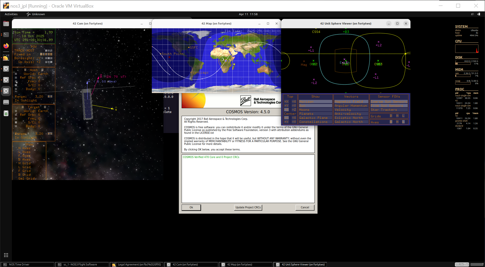
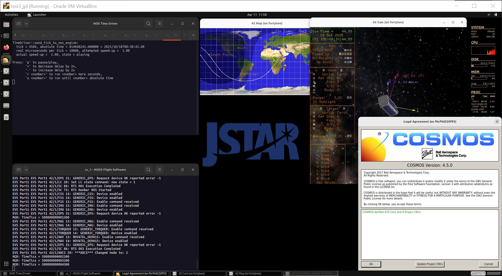

# Scenario - Commissioning

This scenario was developed to provide users with an idea of how to write basic COSMOS scripts to help perform spacecraft commissioning.

In the real world, post-launch and pre-operations is an important time to assess and verify the state of the spacecraft.
Before science can begin, subsystems need to be checked for nominal states and health.
Once these are confirmed, science can be performed and basic 'control' of the spacecraft can be driven by the science team.

This scenario was last updated on 5/7/25 and leveraged the `dev` branch at the time [c35cf24].

## Learning Goals

By the end of this scenario, you should be able to:
* Write simple COSMOS scripts using prompts, wait_checks, and message boxes
* Send commands and receive telemetry using COSMOS Scripting
* Understand the basic goals of spacecraft commissioning and checkout

## Prerequisites

Before running the scenario, ensure the following steps are completed:
* [Getting Started](./Getting_Started.md)
  * [Installation](./Getting_Started.md#installation)
  * [Running](./Getting_Started.md#running)
* No additional file changes or special setup is needed for this scenario

## Walkthrough

With a terminal navigated to the top level of your NOS3 repository:
* `make`


* `make launch`



* Organize the windows for ease of use



* Now we start the COSMOS ground software
  * Click the `Ok` button, followed by the `COSMOS` button in the top left of the follow NOS3 Launcher window that appears
  * Note you may minimize this NOS3 Launcher, but do not close it
  * Our focus is using the COSMOS windows to assist with what we're accomplishing. You may minimize the flashy 42 windows to simplify your environment if you desire.

---
### Identifying Important Commissioning Data

* Commissioning varies from mission to mission, sometimes it's scripted and sometimes it's hands on. 
* At a basic level, we want to confirm the health of our spacecraft, and prepare it for science mode in the future.
* In the real world, commissioning could generate data that various subsystem teams would need to analyze before giving their 'green lights' to proceed with science.

* Let's discuss and identify the minimum information we need to make sure our spacecraft is healthy. 
* We'll do this by answering some basic questions:

  * How much power do we have?
  * What sort of state does the spacecraft think it's in?
  * Are we having weird reboots?
  * Can we turn on the instrument briefly?
  * Can we configure science mode, so we're ready to go when science says we can?

* Using the above questions, take a few minutes to look through the COSMOS Packet Viewer for the following packets: EPS, MGR, and SAMPLE. 
  * What packet fields did you identify as being necessary to answer our questions?

---
### Writing a Commissioning Skeleton

* In a text editor, preferably VS Code, navigate to gsw/cosmos/config/targets/MISSION/procedures and create a new file 'my_commissioning.rb'
* In the first line, write 'require 'mission_lib'

* Let's add Ruby comments to help us navigate what we'll be doing for our commissioning, add the following lines with a blank line or two in between
  * _# Turn on the radio_
  * _# Check our power_
  * _# Verify our state_
  * _# Check for odd reboots_
  * _# Turn on the instrument_
  * _# Configure Science Regions for future use_
  * _# Turn off the radio_

---
### Checking our Power State

* We're going to skip the radio parts for a moment, but let's generate a template we can use to check out our other items. 
* We'll do this with the EPS voltage check.

```
# Check our power
prompt("Proceed with battery voltage check, Press OK to continue.")
wait_check_packet("GENERIC_EPS_RADIO", "GENERIC_EPS_HK_TLM", 1, 10) 
battery_bus_voltage = tlm("GENERIC_EPS_RADIO GENERIC_EPS_HK_TLM BATT_VOLTAGE")
message_box("Battery bus voltage reported to be #{battery_bus_voltage} volts.", "OK", false)
```

* What we've accomplished above is a block that:
  * Checks if we're ready to check a telemetry point
  * Waits for a fresh version of that telemetry
  * And finally, clearly prints the value to screen

* Now, with the EPS Voltage Check as a template, fill in the items needed for our state, and anomalous reboots.

### Commands as part of templates

* There are a few ways to accomplish commanding, but we'll keep it simple. 
* We still need to finish our blocks for Turning on the instrument, and configuring science!
* COSMOS scripting makes sending a command as easy as using the following syntax: _cmd("SAMPLE_RADIO SAMPLE_ENABLE_CC")_
* Using that information, write command blocks for the instrument that:
  1) Generate a prompt for permission to continue
  2) Enables the Sample Instrument
  3) Generate a prompt for when to proceed to turn it back off
  4) Generates a prompt to disable the sample device
  5) Disables the Sample Instrument

* Now, we will configured science mode. The different between this and the above commands is that science mode commands take arguments, whereas above we didn't need arguments.

* A sample Enable Science Region command looks like: _cmd("MGR_RADIO MGR_SET_AK_CC with AK_STATUS ENABLE")_
* Using the above as a template, write a new section to our script thatL
  1) Prompts if it's OK to configure science regions
  2) Enables AK
  3) Enables CONUS
  4) Enables HI

### Turn the Radio On and Off
* We're almost done! 
* Turning out radio on and off for transmit is a critical part of some missions.
* If a radio is left on, it could kill the spacecraft.
* We've written a little help script to abstract this, and we will add it to the top of our script, after the line to _require 'mission_lib'_
```
# First, make sure we can contact the SC and we can receive data from it
enable_TO_and_verify()
sleep(20)
```
* The last thing is to turn the radio off. At the end of your file, add a block that does the following:
  1) Prompt for permission to turn off the radio
  2) Sends the CFS_Radio Command to disable telemetry output

**Let's run it and see how it works!**
