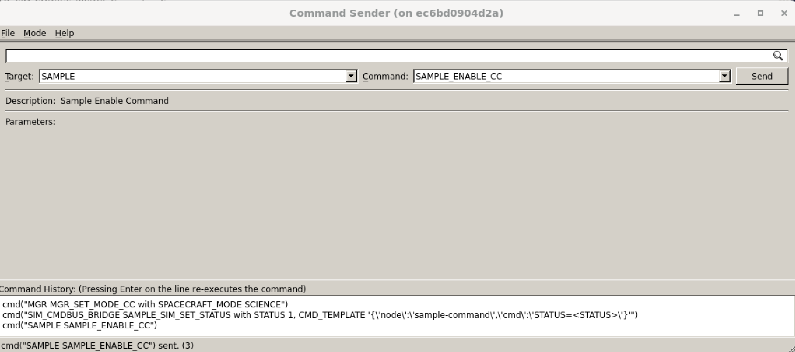
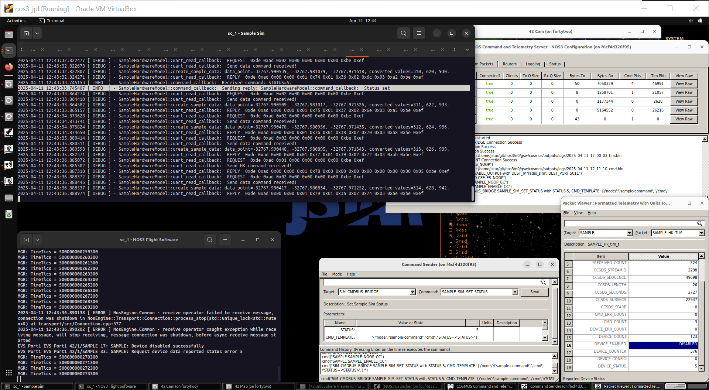
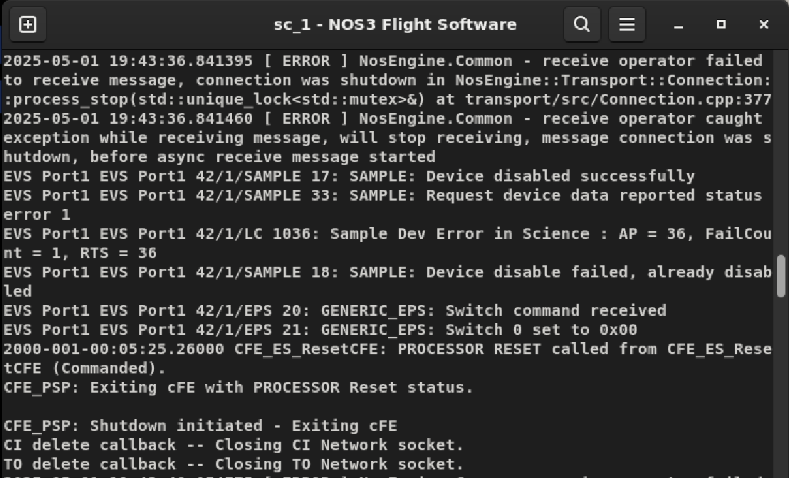
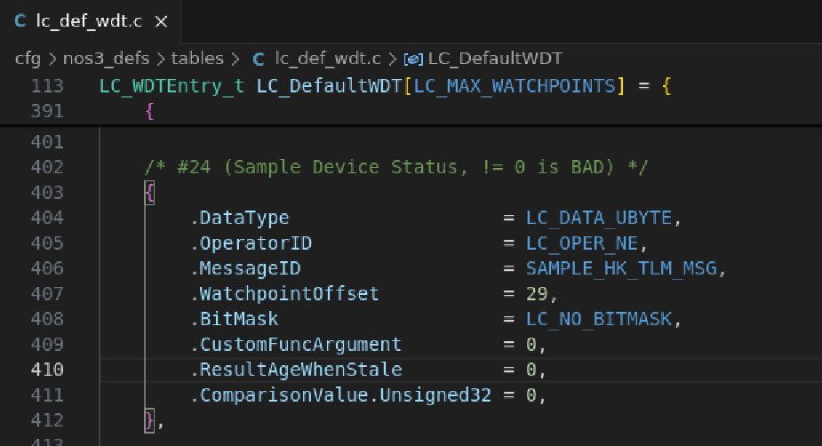
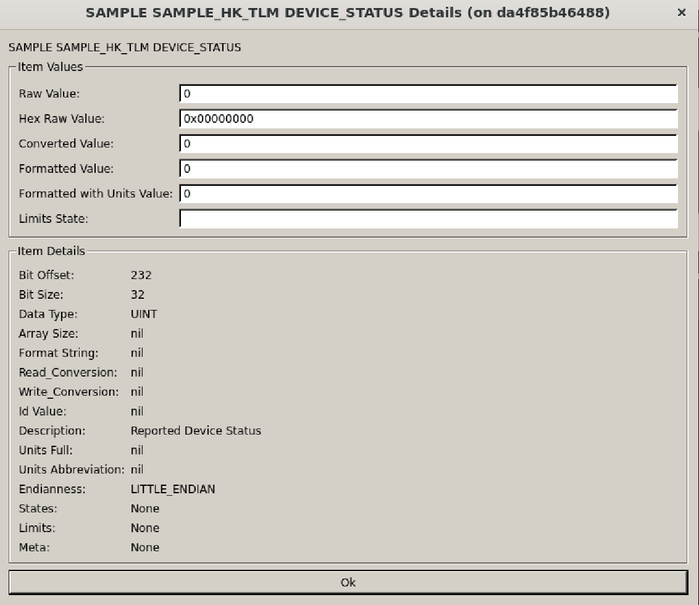

# Scenario - Device Fault in Science Mode

This scenario was developed to provide the user with an example of how the Spacecraft can detect a fault and recover from it. It also provides the user with an overivew of what an AP, WP, and RTS is and what they are used for in LC and SC in cFS FSW.

## Learning Goals

By the end of this scenario, you should be able to:
* Walkthrough a fault scenario where the spacecraft recovers itself by power cycling
* Create a Watch Point
* Create an Action Point
* Create a RTS

## Prerequisites

Before running the scenario, ensure the following steps are completed:
* [Getting Started](./Getting_Started.md)
  * [Installation](./Getting_Started.md#installation)
  * [Running](./Getting_Started.md#running)
* No additional file changes or special setup is needed for this scenario
* Note it is assumed for this scenario the user understands how to command the Spacecraft with cosmos, verify Telemetry via the Packet Viewer, and locate the FSW terminal Window.

## Scenario Walkthrough
Before starting, make sure to launch NOS3 in the default misson configuration in your nos3-mission.xml (sc-mission-config.xml).

### Commanding the Spacecraft into Science mode.

* Once NOS3 is running and FSW enters ADCS Mode 2 (Sunpoint Mode). We can command the spacecraft into Science mode. As Pictured Below.

* This FSW Command will command the spacecraft into Science mode which will kick off RTSs and enable Action Points for this mode. For this scenario, we will be watching Action Point 36 which is activated under Science Mode.

* We will need to send the mgr_set_conus command with value 1. This will allow us to activate the Sample Device when the Spacecraft is over North America and in science mode. This command is seen below.

### Triggering a Simiulated Fault with the Sample Device

* Now, you can wait until your Spacecraft is orbiting over North America Which will enable the sample device or you can enable it manually if you would like to speed up this Scenario Walkthrough.

* once the sample device is enabled you should see the sample device enabled event in cFS in your FSW window as pictured below. Also, take note that AP 36 is activated.

* The sample simulator is now communicating with the sample application
  * The sample application has a scheduled rate at which it requests data from the device
* This is cool, but let's break some stuff
  * Change to the SIM_CMD_BUS_BRIDGE Target in the Command Sender
  * This interface enables us to command the simulators directly so we can see how flight software would respond
  * Let's send the SAMPLE_SIM_SET_STATUS command with a status value of 5

* We successfully told the sample simulator to change its status to 5
  * We see in the sample sim that it received the command to change status
  * The FSW console shows `Device disabled successfully` and `Request device data reported status error 5`

* Now, since we have simulated a fault detected on the sample device by changing the status to 5, Action Point 36 should be detected which will trigger rts036. This is pictured below.

* This RTS will trigger a power cycle event on the spacecraft. Thus, FSW will reset and boot the spacecraft back into safe mode. You should see the STF splash screen come up again in your FSW window. as seen below:

* It is important to understand that we have disabled Action point 36 by default when booting into safe mode, but it is enabled when in Science mode. This is done to protect the spacecraft from resetting cyclically. 
* Basically, we are protecting the spacecraft from constantly resetting itself if a fault is detected, So it is important we disable Action Points like this in the boot up RTS procedures if a user was to add more APs, WPs, and RTS's like this in the future.

## How is this Scenario Possible?

This Scenario is possible because the user created new Action Points, Watch Points, and a new RTS 36. These concepts are described below.

### Creating an Action Point for cFS

An Action Point (AP) is used in Limit Checker (LC) and it defines a specific telemetry parameter to monitor, along with the associated conditions (limits) and actions to take when those limits are violated.

For this scenario, we created Action point 36 and added it to the LC table found in **nos3/cfg/nos3_defs/tables/lc_def.adt.c**.  This is pictured below. Note, AP 36 associates with RTS036 for numbering convention. In practice, it is important to assign APs to the same RTS number for organization within cFS FSW.

### Creating a Watch Point for cFS

A Watch Point (WP) is a used to monitor individual telemetry values and determine if they violate predefined conditions within the Limit Checker (LC) cFS application.

For this Scenario, we created WP 24 in the LC table found in **nos3/cfg/nos3_defs/tables/lc_def.wdt.c**. This was created to track the Device Status telemetry point found in Sample. See below.

Note, the **watchpointoffset** is set equal to 29. This is because the telemetry point bit offset is 232. So 232/8 = 29, which equals the amount of bytes needed for the watchpointoffset in our LC table. The telemtry point details from cosmos is pictured below. This can be found by selecting the hk tlm packet field in packet viewer (Sample_HK_TLM->Device_Status) -> selecting the field -> right clicking on the field -> selecting Details

### Creating an RTS

RTS stands for Real-Time Sequence. It is used by the Stored Command (SC) application to automate the execution of predefined command sequences on the spacecraft.

In this scenario, we created an RTS to execute if our AP 36 condition is true. In this case, if the sample device status telemetry point is not equal to 0, and we are in science mode the spacecraft will enter a power cycle event. This in turn resets FSW as mentioned before. To view what the new RTS looks like you can find the create RTS 36 and review the RTS table in **nos3/cfs/nos3_defs/tables/sc_rts036.c**.

In that rts table you will see the RTS perform the following tasks:
1. Disable the Instrument Application
2. Disable Instrument Switch on EPS
3. Restart CFS

Again, when we boot cFS after a reset we are disabling AP 36, thus prohibiting the spacecraft from entering a FSW reset loop if the device is still broken. We also boot up into safe mode as another precaution.

### Conclusions

The user is now able to Fault the sample device and have the Spaceraft recover itself. Also, the user should have an understanding of what a AP, WP, and RTS do in the cFS system.

