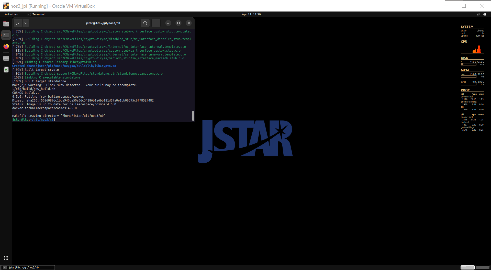
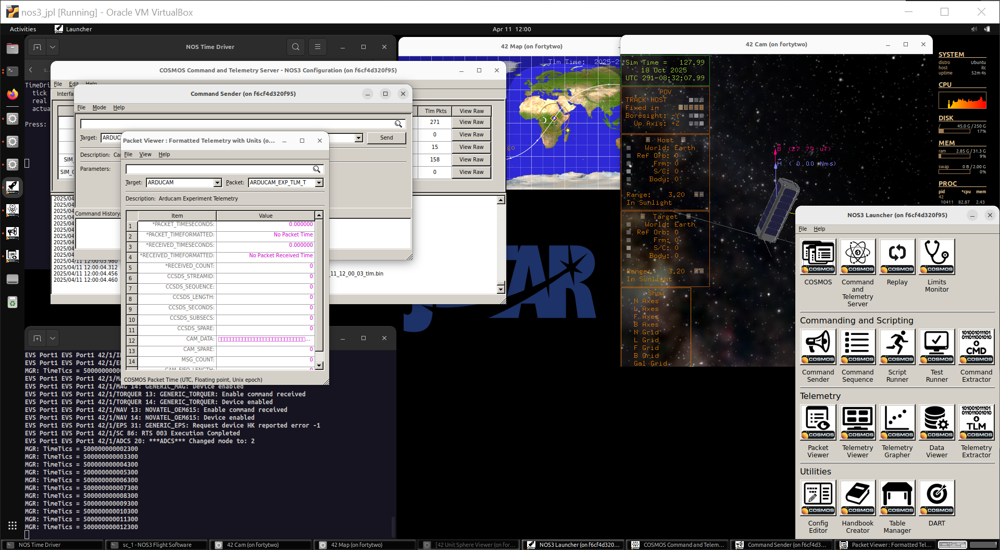
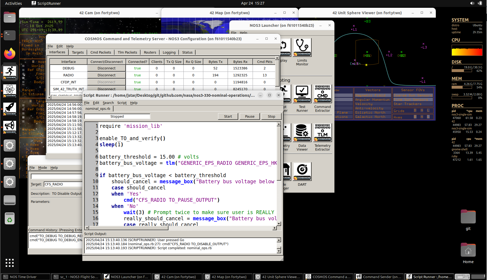

# Scenario - Nominal Operations

This scenario was developed to explain and demonstrate the standard (nominal) operation of a satellite in orbit, using NASA Operational Simulator for Small Satellites (NOS3).
It demonstrates the use of the ground software (GSW) and the expected return telemetry, as well as making use of flight software (FSW) and simulators.

This scenario was last updated on INSERT_DATE_HERE and leveraged the `dev` branch at the time [TIME_HERE].

## Learning Goals

By the end of this scenario, you should be able to:
 * Connect to the simulated spacecraft at the beginning of a simulated pass
 * Send commands to change state or downlink data
 * Understand what portions of NOS3 would be accessible or visible in the context of a real satellite
 * Recognize anomalous telemetry
 * Take a simulated pass with NOS3

## Prerequisites

Before running the scenario, ensure the following steps are completed:
* [Getting Started](./Getting_Started.md)
  * [Installation](./Getting_Started.md#installation)
  * [Running](./Getting_Started.md#running)

## Walkthrough

With a terminal navigated to the top level of your NOS3 repository, run make clean and make:
 * `make clean`

 * `make`

Then, launch NOS3 and open COSMOS:

Open the script runner.  
In the script runner, perform File->Open... and choose the `gsw/cosmos/config/targets/MISSION/procedures/nominal_ops.rb` script.  
Press `Start`:

**_NOTE:_** The user must select `go` when they are done commanding for the pass, since the script does not stop and disconnect COSMOS automatically.
Also, typical passes are of short duration (8-10 minutes) and it is up to the operator to keep track of time and when the pass ends.

