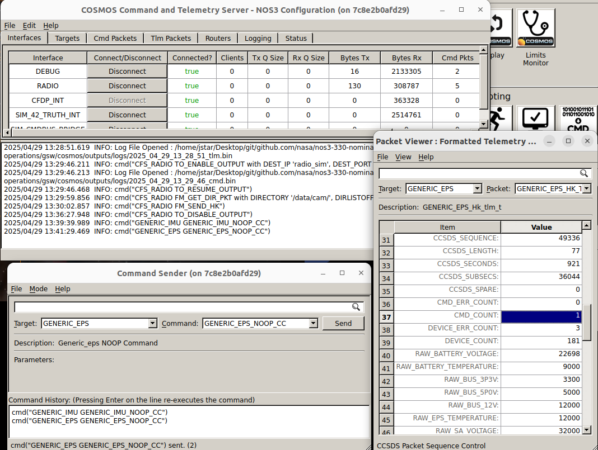
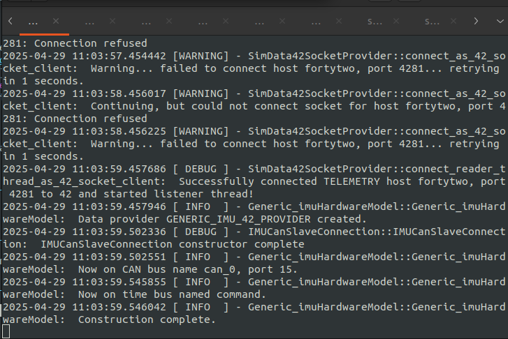
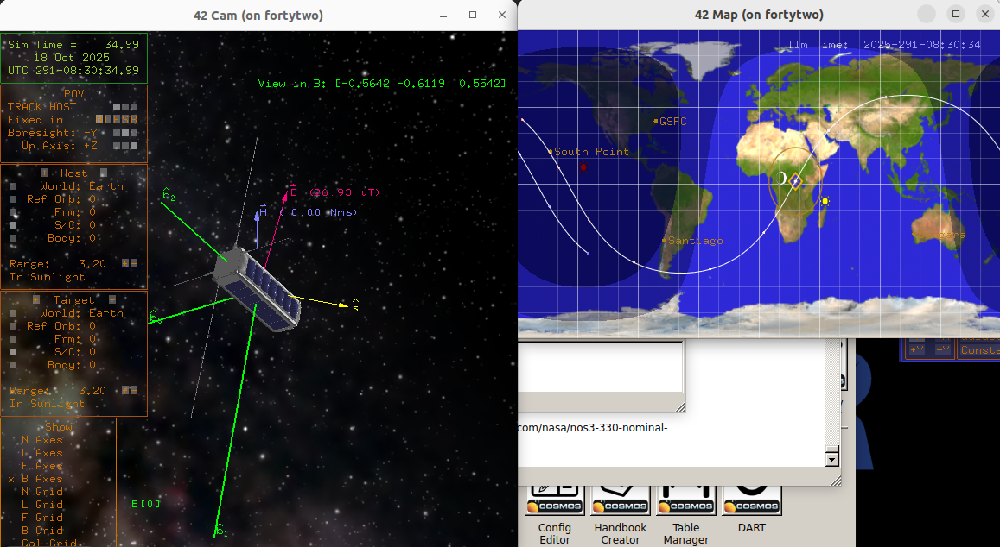
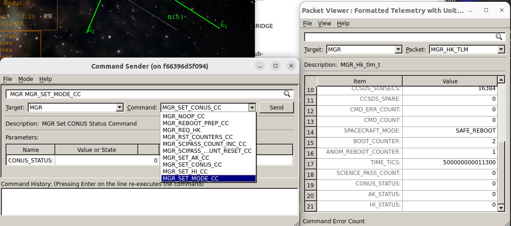
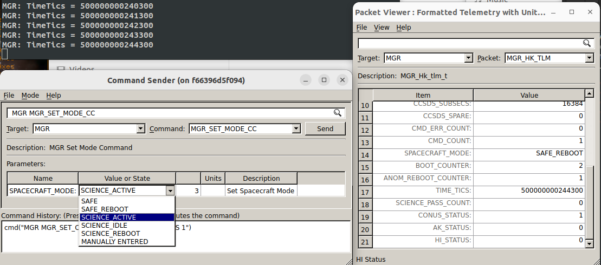
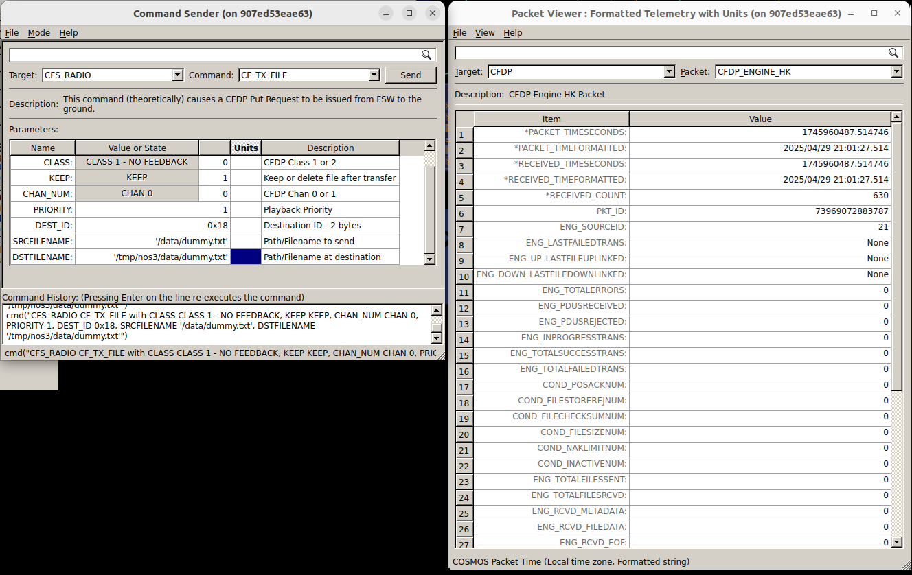
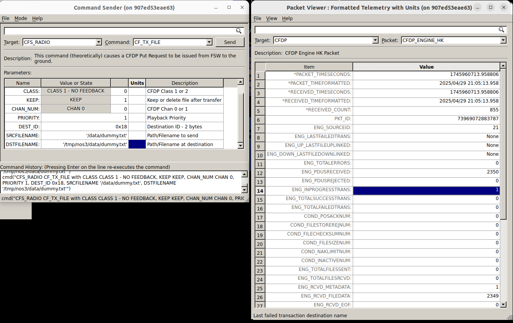
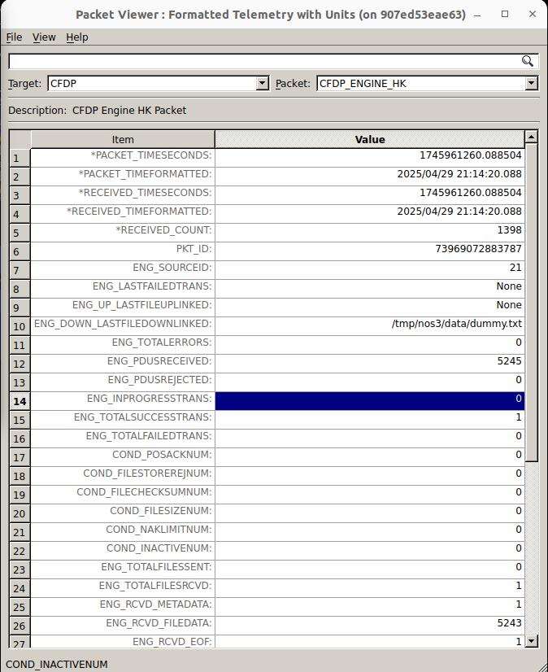

# Scenario - Nominal Operations

This scenario was developed to explain and demonstrate the standard (nominal) operation of a satellite pass for a satellite in orbit, using NASA Operational Simulator for Small Satellites (NOS3).
It demonstrates the use of the ground software (GSW) for commanding and for the expected return telemetry, as well as making use of flight software (FSW) and simulators.

This scenario was last updated on INSERT_DATE_HERE and leveraged the `dev` branch at the time [TIME_HERE].

## Learning Goals

By the end of this scenario, you should be able to:
 * Connect to the simulated spacecraft at the beginning of a simulated pass
 * Send commands to change state or downlink data
 * Understand what portions of NOS3 would be accessible or visible in the context of a real satellite
 * Recognize anomalous telemetry
 * Take a simulated pass with NOS3

## Prerequisites

Before running the scenario, ensure the following steps are completed:
* [Getting Started](./Getting_Started.md)
  * [Installation](./Getting_Started.md#installation)
  * [Running](./Getting_Started.md#running)

## Walkthrough

With a terminal navigated to the top level of your NOS3 repository, run make clean and make:
 * `make clean`

 * `make`

Then, launch NOS3 (using `make launch`) and open COSMOS using the `COSMOS` button in the `NOS3 Launcher` window:

## Taking a pass automatically via scripting

### Connect to the Spacecraft

Before you can do anything else with the spacecraft, you must connect to it.
In the following script, this is done at least partly automatically (the `RADIO` interface is connected automatically), but with a real satellite this would have to be done first, in conjunction with the ground station and at the appropriate time for when your particular satellite would be in range.

### Execute the pass script
Open the script runner from the `NOS3 Launcher`.
In the script runner, perform `File->Open...` and choose the `gsw/cosmos/config/targets/MISSION/procedures/nominal_ops.rb` script.
Press `Start`:

This script will approximate several aspects of taking a pass including enabling telemetry output, verifying spacecraft health via battery telemetry, and downlinking a file.

**_NOTE:_** The user must select `Go` in the script runner window when they are done commanding for the pass, since the script does not stop and disconnect COSMOS automatically.
Also, typical passes are of short duration (8-10 minutes) and it is up to the operator to keep track of time and when the pass ends.

## Taking a pass manually

### Connect to the Spacecraft

Before you can do anything else with the spacecraft, you must connect to it.
With a real satellite this would have to be done first, in conjunction with the ground station and at the appropriate time for when your particular satellite would be in range.
For NOS3, commanding is always connected to the `RADIO` interface, but telemetry can be connected to the `RADIO` interface using the command `CFS_RADIO TO_ENABLE_OUTPUT with DEST_IP 'radio_sim', DEST_PORT 5011`.

### Confirm Telemetry is Nominal

#### COSMOS Alone

The first task is to confirm that spacecraft telemetry is nominal by checking that data is being downlinked and that commands are being sent.
Both can be confirmed by use of the `NOOP` command.
On an actual spacecraft, the only information to which you would have access would be COSMOS and its associated outputs.
As such, we will start by looking only at those to confirm that the spacecraft is in a nominal state before looking at other, simulation only, sources of information.
Among the COSMOS windows, make sure the Command Sender and Packet Viewer are both visible, and in both, navigate to the `GENERIC_IMU` Target:

Within the Packet Viewer, it is possible to see both housekeeping information and regular data, which will allow confirming that information is being sent down and that the satellite is not spinning or in a bad physical state (the values of the IMU's rotational sensors should all be near zero).
Now, to confirm that ground commands have an impact on the IMU, start by sending a `NOOP` command.
This should increment the command counter under the housekeeping data, like so:

Note that the command counter is 2, whereas it should previously have been 1.
Note also that there can be a few second delay between sending the command and the counter reflecting receipt of the command because the telemetry is only received every few seconds.

The other component which should be checked to ensure nominal operations is the electrical power system, or EPS.
Check that the EPS is sending telemetry and is able to receive commands by sending a `NOOP` command and verifying that the command counter increases.
EPS telemetry should also show `BATT_VOLTAGE` as a healthy state of charge (e.g. greater than 15V).

#### 42 and the Simulator

On an actual mission, COSMOS commands and telemetry would be all the information you have available.
When running in a simulator, however, there is more information to which you have access, and which can tell you in fairly short order about the state of the spacecraft and whether it's in nominal operations.

The two other places where information about the spacecraft state is available are 42 and the various simulators.
The simulators are all launched as tabs on the terminal from which you launched NOS3, and a simulator in a nominal state will be both running and (likely) have some message indicating its successful launch and connection to the buses.
Below is an image of the Generic IMU simulator tab, after the simulator has successfully completed construction but before it has begun sending telemetry (which happens automatically):

Then, 42 will indicate the state of the spacecraft to some degree.
Its 42 Cam window will show whether the spacecraft is rotating significantly, as well as showing the spacecraft attitude with respect to the Sun.
The 42 Map window will show the spacecraft location over the Earth:

### Send Commands

Once the spacecraft is known to be in a nominal state, the next step is to either send commands or to downlink data.
This scenario will provide an example of each.

For an example of sending a command, we will direct the spacecraft to enter science mode.
The example spacecraft in NOS3 conducts science using the sample instrument when over the US; it has to be activated into science mode, however, to start performing science.
We will do so via COSMOS.

First, navigate to the Command Sender and go to the Target `MGR`.
Do the same with the Packet Viewer, like so:

Notice the various commands listed in the dropdown menu.
For this we will be sending one to activate science mode (this tells the spacecraft that it's OK to perform science when conditions allow).
This is done by selecting the Command `MGR_SET_MODE_CC` and, in the dropdown menu therein, selecting `SCIENCE_ACTIVE` as the mode, and then pressing `Send`:

Once sent, the `SPACECRAFT_MODE` in the Packet Viewer should switch to `SCIENCE_ACTIVE`.
This change can also be seen in the Flight Software (FSW) terminal (`SCIENCE_ACTIVE` is mode 3).

### Downlink Data

Next we will go through an example of downlinking data.
This is the other thing likely to be done during a pass. 

Our example will be to downlink a file from the on-board data storage using the Consultative Committee for Space Data System Standards (CCSDS) File Delivery Protocol (CFDP).
This will be done using the `CFDP` and `CFS_RADIO` targets.
First, check telemetry for Target `CFDP` and Packet `CFDP_ENGINE_HK`.
Make sure `ENG_INPROGRESSTRANS` is 0, indicating that no file transfer is currently in progress.
In the same packet, make note of the value of `ENG_TOTALSUCCESSTRANS`.
Next, in the command sender window, using Target `CFS_RADIO`, issue command `CF_TX_FILE` with Parameters `CLASS 1 - NO FEEDBACK`, `KEEP`, `CHAN 0`, PRIORITY `1`, DEST_ID `0x18`, SRCFILENAME `'/data/dummy.txt'`, DSTFILENAME `'/tmp/nos3/data/dummy.txt'`.
The Command Sender and Packet Viewer windows below reflect these choices:

After pressing `Send` in the Command Sender, the Packet Viewer window for Target `CFDP` and Packet `CFDP_ENGINE_HK` will show an increasing `ENG_PDUSRECEIVED` and `ENG_INPROGRESSTRANS` will be 1, indicating that a file transfer is currently in progress.
These windows are shown below:

At the completion of the transfer, the Packet Viewer window for Target `CFDP` and Packet `CFDP_ENGINE_HK` will show `ENG_DOWN_LASTFILEDOWNLINKED` as the destination filename and `ENG_TOTALSUCCESSTRANS` should have increased by 1 over the value noted above.
This is shown below:

This completes the learning goals for this scenario.